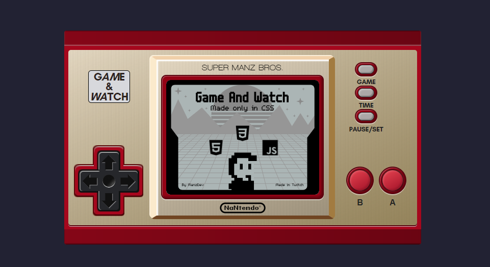

# Nintendo Game & Watch CSS

A **Nintendo Game & Watch** console with **Pure CSS** (without images), created on live stream 🎙 [ManzDev](https://twitch.tv/ManzDev)

---

### 🧙‍♂️ Features

- ✨ Only native [HTML](https://lenguajehtml.com/) + [CSS](https://lenguajecss.com/) + [Javascript](https://lenguajejs.com/)
- ✨ Use [WebComponents](https://lenguajejs.com/webcomponents/) for encapsulation
  - `NintendoGameWatch.js` for console
  - `GameWatchScreen.js` for LCD Screen
  - `GameWatchPad.js` for Pad
  - `CircleButton.js` for red buttons
  - `OptionButton.js` for grey buttons
- ✨ WOFF2 Fonts for texts
  - Glacial Indifference
  - Louis George Cafe
  - Pretendo
  - Walkway
- ✨ Textures with CSS gradients
- ✨ Use [SVG](https://lenguajehtml.com/svg/) for LCD Screen (*Thanks [BlurSoul_](https://github.com/BlurSoulx)*!)

### ⚡ Links

- ✨ [Source code](https://github.com/manzdev/twitch-nintendo-game-watch-css/)
- ✨ [Live demo](https://manzdev.github.io/twitch-nintendo-game-watch-css/)
- ✨ More CSS draws: https://manz.dev/streams
- ✨ Social networks: https://links.manz.dev/
